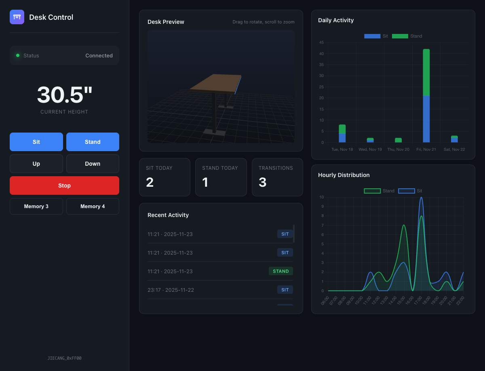

# SitStand - BLE Standing Desk Controller

Control your UPLIFT or Jiecang-based standing desk via Bluetooth Low Energy (BLE).



## Features

- **Command Line Control** - Simple `sit` and `stand` commands
- **Web Interface** - Full dashboard with 3D desk visualization
- **Activity Tracking** - Logs sit/stand transitions with daily/hourly statistics
- **Multiple Desk Variants** - Supports various Jiecang BLE hardware revisions (0xFF00, 0xFE60, 0x00FF, 0xFF12)
- **Auto-discovery** - Automatically finds and caches your desk's BLE address

## Requirements

- Python 3.8+
- macOS, Linux, or Windows with BLE support
- UPLIFT desk with Bluetooth adapter (or compatible Jiecang desk)

## Installation

```bash
# Clone the repository
git clone https://github.com/graiz/sitstand.git
cd sitstand

# Install dependencies
pip install bleak aiohttp
```

## Usage

### Quick Commands

```bash
# Move desk to sitting position (preset 1)
./sit

# Move desk to standing position (preset 2)
./stand
```

### Command Line Interface

```bash
# Available commands: sit, stand, up, down, stop
python desk_control.py sit
python desk_control.py stand
python desk_control.py up
python desk_control.py down
python desk_control.py stop
```

### Web Interface

Start the web server for a full dashboard experience:

```bash
python desk_server.py
```

Then open http://localhost:8080 in your browser.

The web interface includes:
- Real-time height display
- Sit/Stand/Up/Down/Stop controls
- 3D desk visualization that tracks actual height
- Daily and hourly activity charts
- Recent activity log

### Standalone Web App (No Server)

Open `index.html` directly in Chrome, Edge, or Opera for a Web Bluetooth version that connects directly from your browser without needing the Python server.

> Note: Web Bluetooth requires a compatible browser (Chrome, Edge, Opera) and HTTPS or localhost.

## How It Works

The desk communicates over BLE using the Jiecang protocol:

1. **Discovery** - Scans for BLE devices advertising known service UUIDs or matching the desk name pattern
2. **Connection** - Connects and detects which hardware variant based on available services
3. **Wake Sequence** - Sends wake packets to ensure the desk controller is responsive
4. **Commands** - Sends command packets with proper framing and checksum

### Protocol Details

Command packet format:
```
[0xF1, 0xF1] [opcode] [length] [payload...] [checksum] [0x7E]
```

Checksum = (opcode + length + sum(payload)) mod 256

## Configuration

The controller caches configuration in your home directory:

- `~/.desk_address` - Cached BLE MAC address
- `~/.desk_config` - Detected desk variant
- `~/.desk_log` - Activity log (CSV format)

To re-scan for your desk, delete `~/.desk_address`.

## Troubleshooting

**Desk not found:**
- Press a button on your desk's physical controller to wake it up
- Make sure Bluetooth is enabled
- Delete `~/.desk_address` to force a fresh scan

**Connection errors:**
- The desk may be connected to another device (phone app, etc.)
- Try power cycling the desk
- Check that your BLE adapter is working

**Commands not working:**
- Some desk variants need multiple command sends (handled automatically)
- The wake sequence is required before commands

## Credits

Protocol information adapted from [librick/uplift-ble](https://github.com/librick/uplift-ble).

## License

MIT
